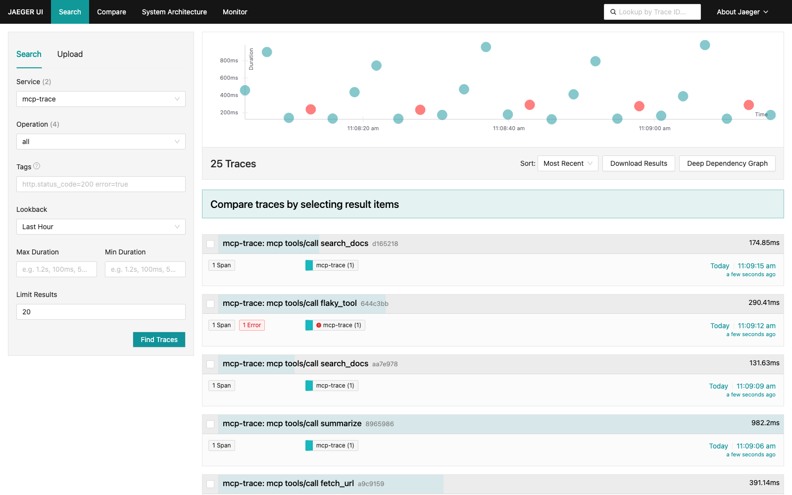
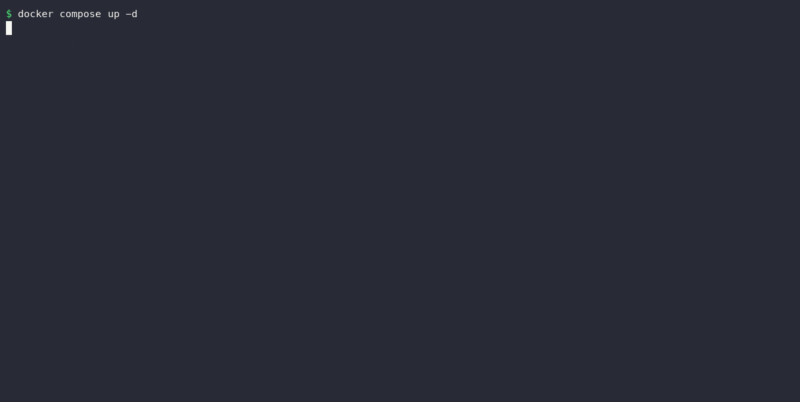

# mcp-trace

[](https://github.com/anhermon/mcp-trace/actions/workflows/ci.yml)
[](https://go.dev/)
[](https://github.com/anhermon/mcp-trace/releases)
[](LICENSE)

**See what your MCP server is actually doing.** An agent calls a tool, it takes
four seconds or fails, and all you have is a client that says "using tool". No
timings, no error text, no history — nothing you can debug or put on a dashboard.

mcp-trace is a transparent proxy you put in front of any MCP server speaking the
HTTP+SSE transport. Every `tools/call` comes out the other side as an
[OpenTelemetry](https://opentelemetry.io/) span — tool name, wall-clock
duration, ok/error, and trace context propagated both ways — in Jaeger, Tempo,
Honeycomb, or anything else that speaks OTLP. The client does not change; you
point it at the proxy's port instead of the server's.



Every row is one MCP tool call: name, duration, and a red badge on the failed
one.

```
MCP Client  →  mcp-trace :8001  →  MCP Server :8000
                     ↓
              OTLP :4317  →  Collector  →  Jaeger / Tempo / Honeycomb
```

## Does this fit your setup? Read this first

mcp-trace sits on the wire, so the transport decides whether it can help you at
all. Check this before installing anything:

| Your MCP server speaks | mcp-trace |
|------------------------|-----------|
| **HTTP+SSE** (`event: endpoint` handshake, separate GET stream and POST endpoint) | ✅ what it is built for |
| **Streamable HTTP** (single endpoint, response returned on the POST) | ❌ not supported |
| **stdio** (local subprocess — how most MCP servers are launched today) | ❌ not supported ([roadmap](#roadmap)) |

Be aware that the official MCP SDKs now mark HTTP+SSE as a legacy transport and
point new work at Streamable HTTP. Plenty of deployed servers still speak
HTTP+SSE and mcp-trace traces them faithfully — but if you are standing up a new
remote server today, check which transport you are on before reaching for this.

## Try it: the demo bundle

Everything below runs with only Docker installed — proxy, OTel Collector,
Jaeger, and a small fake MCP server generating tool calls. The bundle binds
host ports `8001` (mcp-trace) and `16686` (Jaeger UI); if either is already in
use, edit the `ports:` entries in `docker-compose.yml` before starting it.

```bash
git clone https://github.com/anhermon/mcp-trace
cd mcp-trace
docker compose up -d
open http://localhost:16686   # Jaeger UI → select service "mcp-trace"
```

Spans appear within a few seconds. `docker compose down` when you are done.



*The same bundle, start to first trace.*

The demo traffic comes from `examples/demo` — delete the `demo-server` and
`demo-client` services from `docker-compose.yml` and point `--target` at your
own server to trace the real thing.

## Install

```bash
go install github.com/anhermon/mcp-trace/cmd/mcp-trace@latest
```

Or download a binary for your platform from
[Releases](https://github.com/anhermon/mcp-trace/releases).

Then put it in front of your MCP server:

```bash
mcp-trace --target http://localhost:8000/sse --port 8001 --otel-endpoint localhost:4317
```

Point your MCP client at `:8001` instead of `:8000`. Zero client changes required.

### Docker

Build the image locally:

```bash
docker build -t mcp-trace:dev .
docker run --rm -p 8001:8001 mcp-trace:dev \
  --target http://host.docker.internal:8000/sse \
  --otel-endpoint host.docker.internal:4317
```

`-p 8001:8001` is what makes the proxy reachable from the host — without it the
container listens on `:8001` inside its own network namespace and your MCP
client cannot connect.

No `ghcr.io` image is published. Build locally as above.

## Configuration

All flags can be set via a `.mcp-trace.yaml` file (see `.mcp-trace.yaml.example`).

| Flag | Default | Description |
|------|---------|-------------|
| `--target` | *(required)* | Upstream MCP server SSE URL |
| `--port` | `8001` | Local port to listen on |
| `--otel-endpoint` | `localhost:4317` | OTLP gRPC endpoint |
| `--otel-http` | `false` | Use HTTP OTLP exporter instead of gRPC |
| `--otel-http-endpoint` | `http://localhost:4318` | OTLP HTTP endpoint |
| `--otel-insecure` | `true` | Disable TLS for OTLP |
| `--service-name` | `mcp-trace` | OTel `service.name` resource attribute |
| `--trace-all` | `false` | Trace all JSON-RPC methods (not just `tools/call`) |
| `--include-lifecycle` | `false` | Include `initialize`/`ping`/`notifications/*` |
| `--capture-tool-args` | `false` | Record full tool arguments on spans (may contain secrets) |
| `--log-level` | `info` | `debug` \| `info` \| `warn` \| `error` |
| `--config` | | Path to config file |

## Environment variables

Every CLI flag can also be set via an environment variable using the `MCP_TRACE_` prefix. Nested OTel keys use `_` as a separator (`.` → `_`).

| Environment variable | Equivalent flag | Example |
|----------------------|-----------------|---------|
| `MCP_TRACE_TARGET` | `--target` | `http://localhost:8000/sse` |
| `MCP_TRACE_PORT` | `--port` | `8001` |
| `MCP_TRACE_OTEL_ENDPOINT` | `--otel-endpoint` | `localhost:4317` |
| `MCP_TRACE_OTEL_HTTP` | `--otel-http` | `true` |
| `MCP_TRACE_OTEL_HTTP_ENDPOINT` | `--otel-http-endpoint` | `http://localhost:4318` |
| `MCP_TRACE_OTEL_INSECURE` | `--otel-insecure` | `true` |
| `MCP_TRACE_OTEL_SERVICE_NAME` | `--service-name` | `my-mcp-server` |
| `MCP_TRACE_TRACE_ALL` | `--trace-all` | `true` |
| `MCP_TRACE_INCLUDE_LIFECYCLE` | `--include-lifecycle` | `true` |
| `MCP_TRACE_CAPTURE_TOOL_ARGS` | `--capture-tool-args` | `true` |
| `MCP_TRACE_LOG_LEVEL` | `--log-level` | `debug` |

> The service-name variable is `MCP_TRACE_OTEL_SERVICE_NAME`, not
> `MCP_TRACE_SERVICE_NAME` — the underlying config key is `otel.service_name`.

Environment variables override config-file values. CLI flags take the highest precedence.

**Docker example** — run mcp-trace entirely via environment, no flags needed:

```bash
docker run --rm -p 8001:8001 \
  -e MCP_TRACE_TARGET=http://host.docker.internal:8000/sse \
  -e MCP_TRACE_OTEL_ENDPOINT=host.docker.internal:4317 \
  -e MCP_TRACE_OTEL_SERVICE_NAME=my-service \
  mcp-trace:dev
```

## Span schema

Every traced call produces a span with these attributes:

| Attribute | Present on | Description |
|-----------|------------|-------------|
| `mcp.method` | all spans | JSON-RPC method |
| `mcp.request.id` | all spans | JSON-RPC request id |
| `mcp.server.target` | all spans | Upstream URL |
| `mcp.duration_ms` | all spans | Wall-clock duration in ms |
| `mcp.status` | all spans | `ok`, `error`, `timeout`, or `abandoned` |
| `mcp.session.id` | when the server advertises one | MCP session — groups one client's calls |
| `mcp.client.name` | when the client sent `initialize` | Client name from `clientInfo` |
| `mcp.client.version` | when the client sent `initialize` | Client version from `clientInfo` |
| `mcp.tool.name` | tools/call only | Tool name |
| `mcp.tool.argument_keys` | tools/call with arguments | Argument names, comma-separated |
| `mcp.tool.arguments` | tools/call, with `--capture-tool-args` | Full arguments as JSON (truncated at 2 KiB) |
| `mcp.tool.duration_ms` | tools/call only | Wall-clock duration in ms |
| `mcp.tool.status` | tools/call only | Same values as `mcp.status` |
| `mcp.response.size_bytes` | answered spans | Size of the JSON-RPC response |
| `mcp.rpc.error_code` | JSON-RPC protocol errors | e.g. `-32602` (invalid params) |
| `error` | non-ok spans | `true` |
| `error.message` | non-ok spans | Error message or the reason the call never completed |

### What `mcp.status` tells you

The difference between these is the difference between "look at the tool" and
"look at the network", so they are not collapsed into one `error` value:

| Status | Meaning | Where to look |
|--------|---------|---------------|
| `ok` | The server answered normally | — |
| `error` | The server answered with a JSON-RPC or tool-level error | The tool. `error.message` and `mcp.rpc.error_code` carry the detail |
| `abandoned` | The SSE stream closed before the answer arrived | `error.message` says whether the **client** disconnected or the **upstream server** died. Duration is time until the break, not a deadline |
| `timeout` | No answer within the span deadline while the stream stayed open | The server accepted the call and went quiet |

### Tool arguments

`mcp.tool.argument_keys` (argument *names* only) is recorded by default: it tells
you which call shape failed without putting file paths, search queries, or
credentials into your trace backend. Pass `--capture-tool-args` to record the
values as well — only do that where you control the backend, since tool
arguments are user data.

Spans are emitted with `SpanKind = client`. If the caller sends a `traceparent`
header, the span is created as a child of that trace; either way mcp-trace
injects `traceparent` into the request it forwards upstream, so the MCP server
can continue the same trace.

Span names follow the pattern:
- `mcp tools/call read_file` (tool calls)
- `mcp tools/list` (other methods, with `--trace-all`)

## Wiring an MCP client through the proxy

Start mcp-trace next to your server:

```bash
mcp-trace --target http://localhost:8000/sse --port 8001 --otel-endpoint localhost:4317
```

Then point the client's SSE URL at the proxy instead of the server:

```json
{
  "mcpServers": {
    "my-server-traced": {
      "type": "sse",
      "url": "http://localhost:8001/sse"
    }
  }
}
```

mcp-trace speaks the MCP HTTP+SSE transport only — see
[Does this fit your setup?](#does-this-fit-your-setup-read-this-first).

### Limitation: servers advertising an absolute POST endpoint

In the HTTP+SSE transport the server tells the client where to POST, via an
`event: endpoint` message at the start of the stream. mcp-trace forwards that
value through unchanged. If a server advertises a **relative** path
(`/messages/?session_id=…`) — which the mainstream Python and TypeScript MCP
SDKs do — the client resolves it against the proxy's own origin and everything
is traced.

If a server advertises an **absolute** URL (`http://server:8000/messages/…`),
the client POSTs straight to the server, bypassing the proxy. The SSE stream
still works, so nothing errors — you simply get **zero tool-call spans**. If you
see traffic flowing but no spans, check what your server puts in `event:
endpoint`; if it is absolute, terminate it behind a reverse proxy that rewrites
the value, or configure the server to advertise a relative path.

## Development

```bash
task build    # build binary to bin/mcp-trace
task test     # run all tests
task ci       # full pipeline: vet + test + lint + build
task release  # cross-compile all platforms to dist/
task demo     # start the demo bundle (Jaeger UI on :16686)
```

### Pre-commit hooks

Install hooks that run `task ci` before every commit and `task check` before every push:

```bash
task hooks:install
```

Remove hooks:

```bash
task hooks:uninstall
```

Hooks are stored in `scripts/hooks/` and copied into `.git/hooks/`. Bypass in emergencies with `--no-verify` (use sparingly).

## Roadmap

- **v1.0** — SSE proxy with OTLP spans (this release)
- **v2.0** — stdio transport support (`mcp-trace --stdio -- <command>`)
- **v2.x** — Metrics (counters, histograms), sampling

## License

MIT
